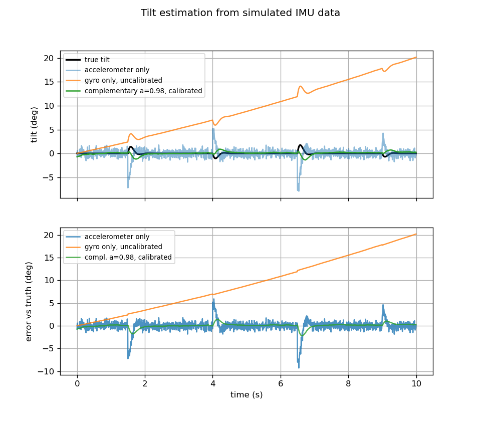

# balancebot

A self-balancing two-wheeled robot, built on an STM32 NUCLEO-F446RE and an MPU-6050 IMU.

**Status:** the simulation (control and tilt estimation) is done. The firmware builds, but nothing has run on hardware yet; the parts are on order.

## Simulation: the balancing problem first

Before buying motors, I modeled the robot as an inverted pendulum in Python and tuned a PID controller on the model. The goal was to learn what each gain does and what limits them.

Model: the wheels accelerate the base by `a`, and the body (center of mass `L = 0.10 m` above the axle) tilts by `theta`:

    theta_ddot = (g * sin(theta) - a * cos(theta)) / L

The simulation steps at 200 Hz (5 ms), the loop rate planned for the Nucleo. Wheel acceleration is limited to 5 m/s^2.

| Script | What it does |
|---|---|
| `pendulum_fall.py` | No controller. A 3 degree lean falls over in 0.42 s. |
| `pid_balance.py` | PID controller holds the robot upright and recovers from a shove. |
| `gain_sweep.py` | Changes one gain at a time to show what each term does. |
| `noisy_sweep.py` | Adds sensor noise, a 15 ms control delay and 30 ms motor lag. |
| `complementary_filter.py` | Estimates tilt from a noisy accelerometer and a drifting gyro. |

Run any of them with `python3 <script>.py` (needs Python 3 and matplotlib). Each saves a PNG next to the script.

## Control results

Ideal sensors and motors (`gain_sweep.py`):

| Case | kp | ki | kd | Result |
|---|---|---|---|---|
| baseline | 30 | 0 | 1.5 | stays up, 1.4 deg max tilt after shove |
| kp too low | 8 | 0 | 1.5 | falls at 2.19 s |
| no damping | 30 | 0 | 0 | swings back and forth forever, 4.4 deg |
| kd too high | 30 | 0 | 8 | stays up, slow and smooth |
| kp very high | 200 | 0 | 4 | stays up, fastest response |
| with ki | 30 | 40 | 1.5 | about the same as baseline |

With noise and delay added (`noisy_sweep.py`, one noise seed):

| Case | kp | kd | Result |
|---|---|---|---|
| baseline | 30 | 1.5 | stays up, 0.67 deg rms tilt jitter |
| kp very high | 200 | 4 | falls at 0.65 s |
| kd too high | 30 | 8 | stays up, but command jitter is 4.11 m/s^2 (8x baseline) |
| kp 60, kd 2.5 | 60 | 2.5 | falls at 2.18 s |

What I take from this:

- `kp` must exceed gravity (9.81) or the robot cannot catch itself.
- `kd` damps the motion, but it also amplifies sensor noise.
- The gain that looks best with ideal sensors (`kp = 200`) falls within a second once a 15 ms delay is added. Delay and noise, not the physics, limit how aggressive the gains can be.
- The controller stays upright but the robot drifts: speed ends at about 0.14 m/s. Fixing that needs a speed or position loop on top of the tilt loop.

## Tilt estimation results

The controller needs a tilt angle, and the IMU gives two imperfect measurements of it. `complementary_filter.py` fakes both sensors with the faults real ones have, then compares each estimate with the true tilt over a 10 s run with four shoves:

- The **accelerometer** gives the angle from the direction of gravity. It is noisy, and it is fooled whenever the wheels accelerate the robot, because it cannot tell that push from gravity.
- The **gyro** gives a smooth rate of rotation, but its offset drifts, so the integrated angle wanders away.
- The **complementary filter** `est = a * (est + gyro * dt) + (1 - a) * accel_angle` trusts the gyro for fast changes and the accelerometer for the slow average. The gyro's resting offset is calibrated out during the first 0.5 s, while the robot is still.

| Method | RMS error | Max error |
|---|---|---|
| accelerometer only | 1.23 deg | 9.28 deg |
| gyro only, uncalibrated | 11.01 deg | 20.18 deg |
| gyro only, calibrated | 1.99 deg | 4.45 deg |
| complementary a=0.98, uncalibrated | 0.63 deg | 1.80 deg |
| complementary a=0.90, calibrated | 0.90 deg | 5.72 deg |
| complementary a=0.98, calibrated | 0.48 deg | 2.19 deg |
| complementary a=0.995, calibrated | 0.46 deg | 0.90 deg |

`a = 0.98` at 200 Hz is a time constant of 245 ms. A higher `a` rejects the wheel-acceleration errors better but lets gyro drift build up, and a lower one does the reverse, so the final value will be chosen on real sensor data.

## Firmware (in progress)

`firmware/` is a PlatformIO project (STM32Cube HAL) for the NUCLEO-F446RE.

- `src/mpu6050.c` is a minimal I2C driver: it wakes the sensor, sets a +/-500 deg/s gyro range, a +/-2 g accelerometer range and a 44 Hz low-pass filter, and reads all axes in one 14-byte burst.
- `src/main.c` reads the sensor every 100 ms and prints the raw values over the ST-Link USB serial port at 115200 baud.
- Wiring: MPU-6050 SCL to PB8 (D15), SDA to PB9 (D14), VCC to 3.3 V, GND to GND.

**Status:** it builds cleanly (about 8 KB of flash). It has not been run on hardware yet.

## Limitations

- The sensor noise, the gyro drift, the 15 ms delay and the 30 ms motor lag are assumptions, not measurements. They will be replaced with real numbers from the hardware.
- The model is a point-mass pendulum with no wheel inertia, friction or motor dynamics.
- The tilt filter is evaluated offline on recorded motion; it is not yet in the control loop.

## Next

1. Run the firmware on the Nucleo: blink, then read and calibrate the MPU-6050.
2. Port the complementary filter to C and compare its output with the simulation.
3. Drive the motors and read the encoders.
4. Build the chassis and run the real controller.
5. Measure the real delay and noise, and compare them with this simulation.
