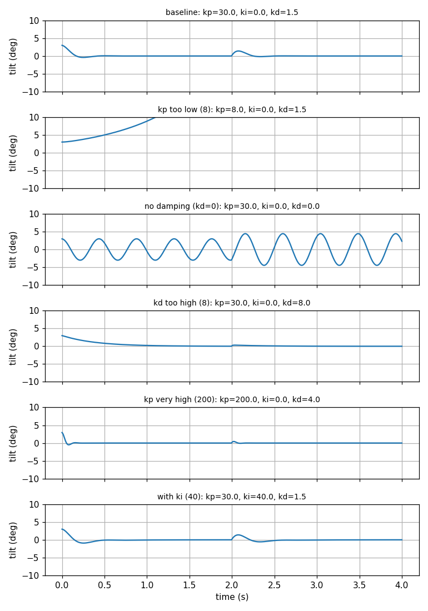
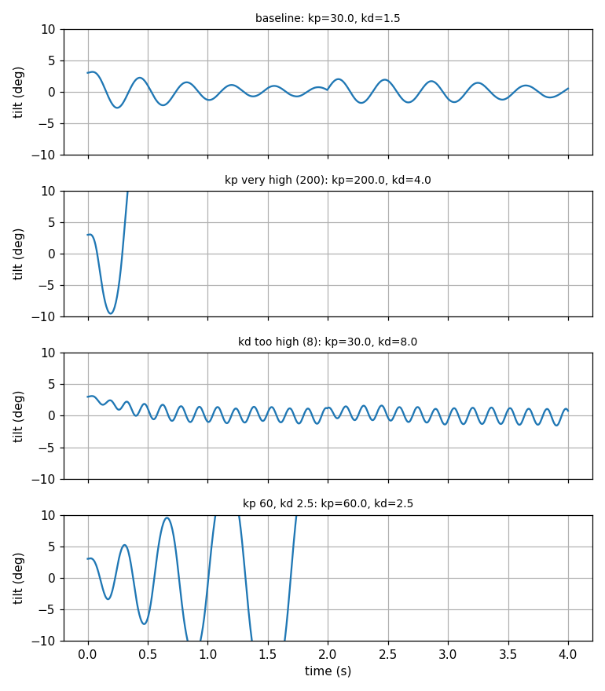

# balancebot

A self-balancing two-wheeled robot, built on an STM32 NUCLEO-F446RE and an MPU-6050 IMU.

**Status:** Phase 1 (simulation) is done. The hardware phases have not started yet; the parts are on order.

## Phase 1: simulate the balancing problem first

Before buying motors, I modeled the robot as an inverted pendulum in Python and tuned a PID controller on the model. The goal was to learn what each gain does and what limits them.

Model: the wheels accelerate the base by `a`, and the body (center of mass `L = 0.10 m` above the axle) tilts by `theta`:

    theta_ddot = (g * sin(theta) - a * cos(theta)) / L

The simulation steps at 200 Hz (5 ms), the loop rate planned for the Nucleo. Wheel acceleration is limited to 5 m/s^2.

| Script | What it does |
|---|---|
| `pendulum_fall.py` | No controller. A 3 degree lean falls over in 0.42 s. |
| `pid_balance.py` | PID controller holds the robot upright and recovers from a shove. |
| `gain_sweep.py` | Changes one gain at a time to show what each term does. |
| `noisy_sweep.py` | Adds sensor noise, a 15 ms control delay and 30 ms motor lag. |

Run any of them with `python3 <script>.py` (needs Python 3 and matplotlib). Each saves a PNG next to the script.

## Results

Ideal sensors and motors (`gain_sweep.py`):

| Case | kp | ki | kd | Result |
|---|---|---|---|---|
| baseline | 30 | 0 | 1.5 | stays up, 1.4 deg max tilt after shove |
| kp too low | 8 | 0 | 1.5 | falls at 2.19 s |
| no damping | 30 | 0 | 0 | swings back and forth forever, 4.4 deg |
| kd too high | 30 | 0 | 8 | stays up, slow and smooth |
| kp very high | 200 | 0 | 4 | stays up, fastest response |
| with ki | 30 | 40 | 1.5 | about the same as baseline |

With noise and delay added (`noisy_sweep.py`, one noise seed):

| Case | kp | kd | Result |
|---|---|---|---|
| baseline | 30 | 1.5 | stays up, 0.67 deg rms tilt jitter |
| kp very high | 200 | 4 | falls at 0.65 s |
| kd too high | 30 | 8 | stays up, but command jitter is 4.11 m/s^2 (8x baseline) |
| kp 60, kd 2.5 | 60 | 2.5 | falls at 2.18 s |

What I take from this:

- `kp` must exceed gravity (9.81) or the robot cannot catch itself.
- `kd` damps the motion, but it also amplifies sensor noise.
- The gain that looks best with ideal sensors (`kp = 200`) falls within a second once a 15 ms delay is added. Delay and noise, not the physics, limit how aggressive the gains can be.
- The controller stays upright but the robot drifts: speed ends at about 0.14 m/s. Fixing that needs a speed or position loop on top of the tilt loop.

## Limitations

- The noise levels, the 15 ms delay and the 30 ms motor lag are assumptions, not measurements. They will be replaced with real numbers from the hardware.
- The model is a point-mass pendulum with no wheel inertia, friction or motor dynamics.

## Next

1. Read the MPU-6050 over I2C on the Nucleo and calibrate it.
2. Estimate tilt with a complementary filter.
3. Drive the motors and read the encoders.
4. Build the chassis and run the real controller.
5. Measure the real delay and noise, and compare them with this simulation.
